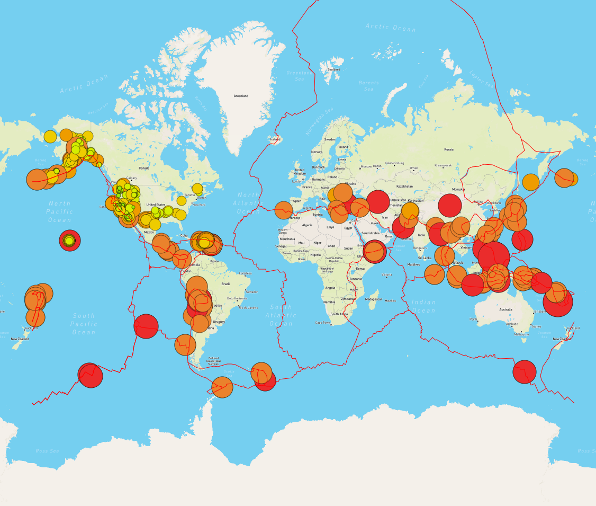

# Mapping_Earthquakes
The main folder for this project is the **`Earthquake_Challenge`** folder.

## Overview

### Purpose
Visualize the earthquake data displaying only magnitude greater than 4.5, display tectonic plates, and add other map views.

### Background
Basil and Sadhana would like to see the earthquake data in relation to the tectonic plates’ location on the earth, and they would like to see all the earthquakes with a magnitude greater than 4.5 on the map, and they would like to see the data on a third map.

## Result
To produce the following result Mapbox API, Leaflet, d3.json, geoJSON, and more were used.

